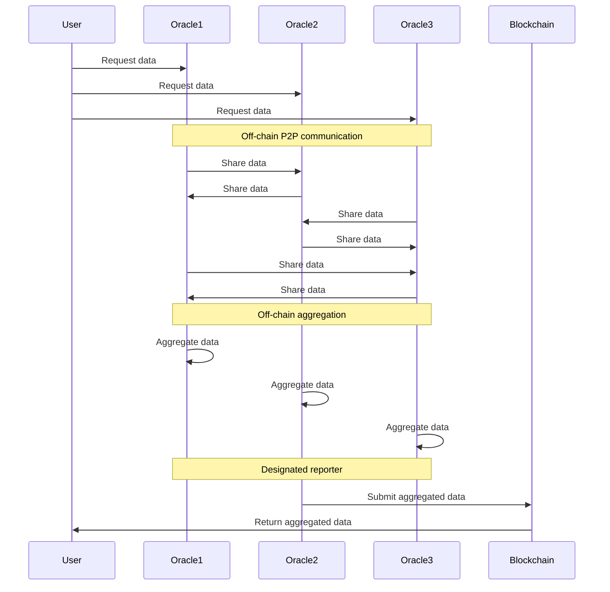
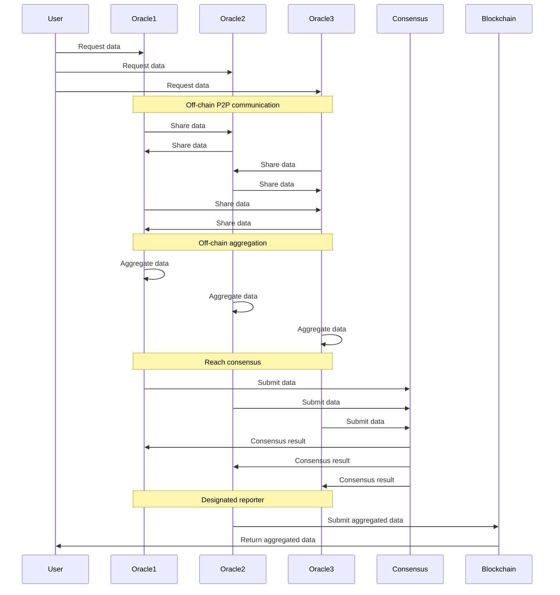
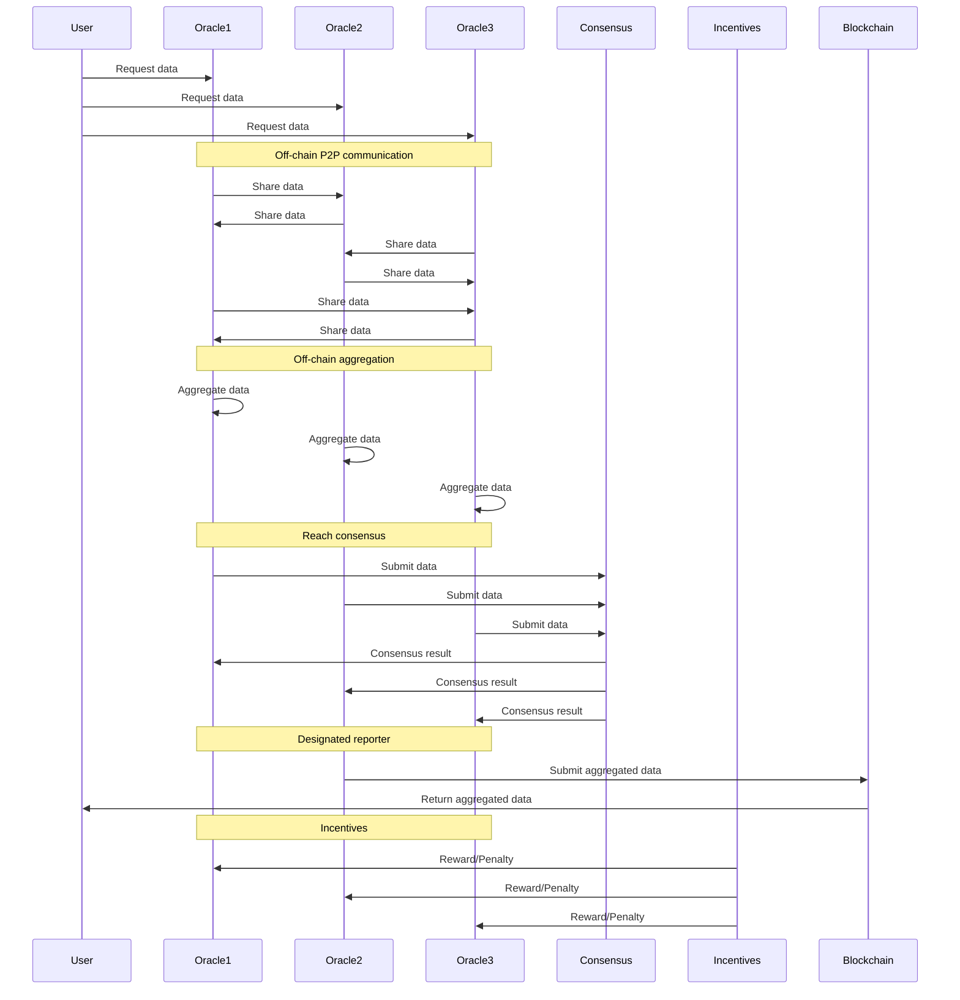
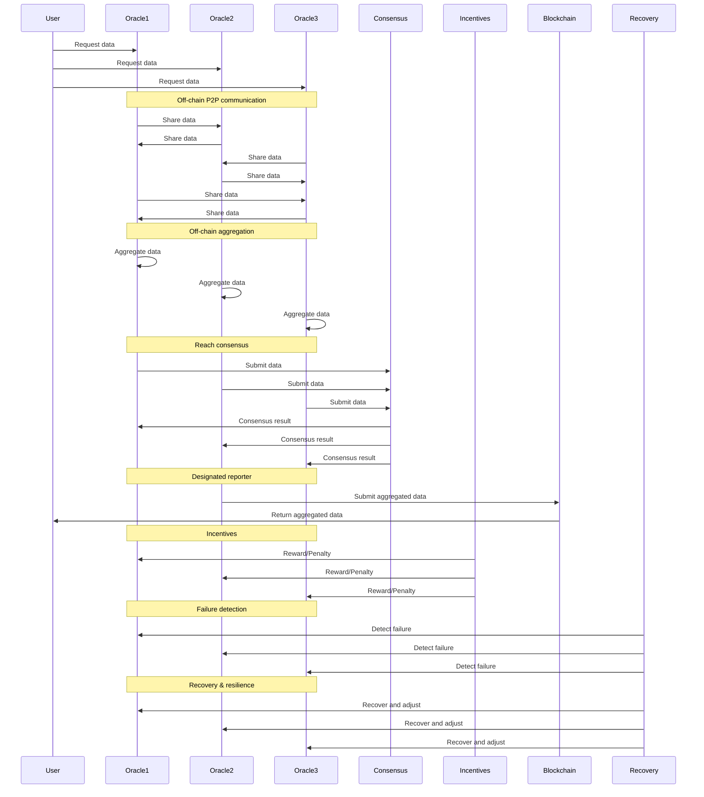

## Off-Chain Reporting: 

### 1. Simple Interactions 

```mermaid
sequenceDiagram
    participant User
    participant Oracle1
    participant Oracle2
    participant Oracle3
    participant Blockchain

    User->>Oracle1: Request data
    User->>Oracle2: Request data
    User->>Oracle3: Request data
    Note over Oracle1, Oracle3: Off-chain P2P communication
    Oracle1->>Oracle2: Share data
    Oracle2->>Oracle1: Share data
    Oracle3->>Oracle2: Share data
    Oracle2->>Oracle3: Share data
    Oracle1->>Oracle3: Share data
    Oracle3->>Oracle1: Share data
    Note over Oracle1, Oracle3: Off-chain aggregation
    Oracle1->>Oracle1: Aggregate data
    Oracle2->>Oracle2: Aggregate data
    Oracle3->>Oracle3: Aggregate data
    Note over Oracle1, Oracle3: Designated reporter
    Oracle2->>Blockchain: Submit aggregated data
    Blockchain->>User: Return aggregated data
```

### 2. Simple With Consensus Algorithm 

```mermaid 
sequenceDiagram
    participant User
    participant Oracle1
    participant Oracle2
    participant Oracle3
    participant Consensus
    participant Blockchain

    User->>Oracle1: Request data
    User->>Oracle2: Request data
    User->>Oracle3: Request data
    Note over Oracle1, Oracle3: Off-chain P2P communication
    Oracle1->>Oracle2: Share data
    Oracle2->>Oracle1: Share data
    Oracle3->>Oracle2: Share data
    Oracle2->>Oracle3: Share data
    Oracle1->>Oracle3: Share data
    Oracle3->>Oracle1: Share data
    Note over Oracle1, Oracle3: Off-chain aggregation
    Oracle1->>Oracle1: Aggregate data
    Oracle2->>Oracle2: Aggregate data
    Oracle3->>Oracle3: Aggregate data
    Note over Oracle1, Oracle3: Reach consensus
    Oracle1->>Consensus: Submit data
    Oracle2->>Consensus: Submit data
    Oracle3->>Consensus: Submit data
    Consensus->>Oracle1: Consensus result
    Consensus->>Oracle2: Consensus result
    Consensus->>Oracle3: Consensus result
    Note over Oracle1, Oracle3: Designated reporter
    Oracle2->>Blockchain: Submit aggregated data
    Blockchain->>User: Return aggregated data
```

### 3. Simple With Incentive Structure 

```mermaid
sequenceDiagram
    participant User
    participant Oracle1
    participant Oracle2
    participant Oracle3
    participant Consensus
    participant Incentives
    participant Blockchain

    User->>Oracle1: Request data
    User->>Oracle2: Request data
    User->>Oracle3: Request data
    Note over Oracle1, Oracle3: Off-chain P2P communication
    Oracle1->>Oracle2: Share data
    Oracle2->>Oracle1: Share data
    Oracle3->>Oracle2: Share data
    Oracle2->>Oracle3: Share data
    Oracle1->>Oracle3: Share data
    Oracle3->>Oracle1: Share data
    Note over Oracle1, Oracle3: Off-chain aggregation
    Oracle1->>Oracle1: Aggregate data
    Oracle2->>Oracle2: Aggregate data
    Oracle3->>Oracle3: Aggregate data
    Note over Oracle1, Oracle3: Reach consensus
    Oracle1->>Consensus: Submit data
    Oracle2->>Consensus: Submit data
    Oracle3->>Consensus: Submit data
    Consensus->>Oracle1: Consensus result
    Consensus->>Oracle2: Consensus result
    Consensus->>Oracle3: Consensus result
    Note over Oracle1, Oracle3: Designated reporter
    Oracle2->>Blockchain: Submit aggregated data
    Blockchain->>User: Return aggregated data
    Note over Oracle1, Oracle3: Incentives
    Incentives->>Oracle1: Reward/Penalty
    Incentives->>Oracle2: Reward/Penalty
    Incentives->>Oracle3: Reward/Penalty
```

### 4. Simple With Failure Recovery and Resilience

```mermaid
sequenceDiagram
    participant User
    participant Oracle1
    participant Oracle2
    participant Oracle3
    participant Consensus
    participant Incentives
    participant Blockchain
    participant Recovery

    User->>Oracle1: Request data
    User->>Oracle2: Request data
    User->>Oracle3: Request data
    Note over Oracle1, Oracle3: Off-chain P2P communication
    Oracle1->>Oracle2: Share data
    Oracle2->>Oracle1: Share data
    Oracle3->>Oracle2: Share data
    Oracle2->>Oracle3: Share data
    Oracle1->>Oracle3: Share data
    Oracle3->>Oracle1: Share data
    Note over Oracle1, Oracle3: Off-chain aggregation
    Oracle1->>Oracle1: Aggregate data
    Oracle2->>Oracle2: Aggregate data
    Oracle3->>Oracle3: Aggregate data
    Note over Oracle1, Oracle3: Reach consensus
    Oracle1->>Consensus: Submit data
    Oracle2->>Consensus: Submit data
    Oracle3->>Consensus: Submit data
    Consensus->>Oracle1: Consensus result
    Consensus->>Oracle2: Consensus result
    Consensus->>Oracle3: Consensus result
    Note over Oracle1, Oracle3: Designated reporter
    Oracle2->>Blockchain: Submit aggregated data
    Blockchain->>User: Return aggregated data
    Note over Oracle1, Oracle3: Incentives
    Incentives->>Oracle1: Reward/Penalty
    Incentives->>Oracle2: Reward/Penalty
    Incentives->>Oracle3: Reward/Penalty
    Note over Oracle1, Oracle3: Failure detection
    Recovery->>Oracle1: Detect failure
    Recovery->>Oracle2: Detect failure
    Recovery->>Oracle3: Detect failure
    Note over Oracle1, Oracle3: Recovery & resilience
    Recovery->>Oracle1: Recover and adjust
    Recovery->>Oracle2: Recover and adjust
    Recovery->>Oracle3: Recover and adjust

```